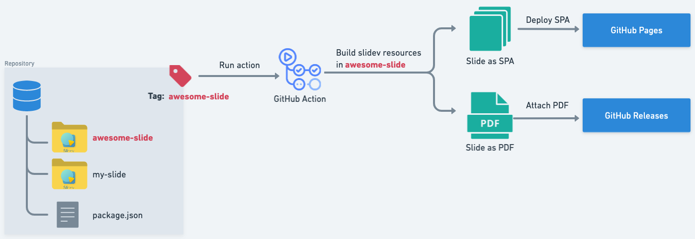
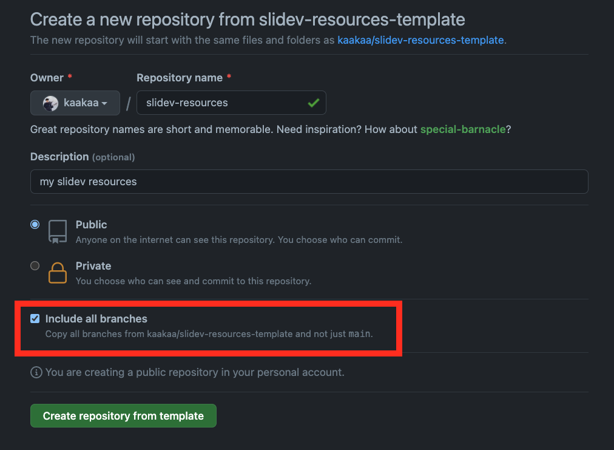
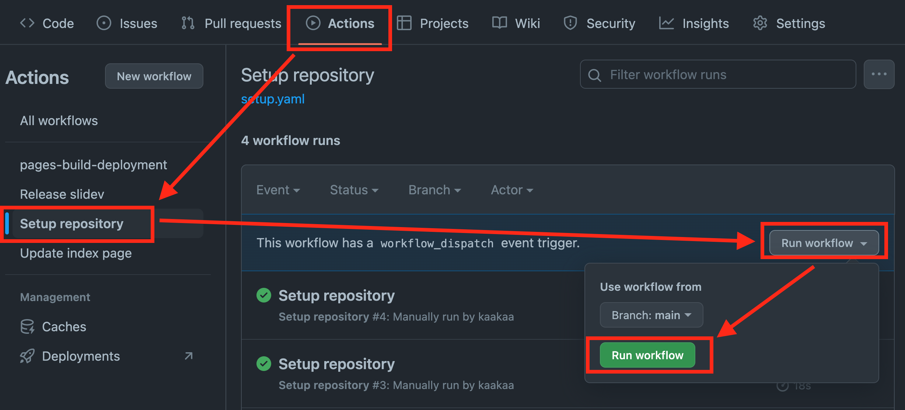

[](https://github.com/kaakaa/slidev-resources-template/actions/workflows/release.yaml)
# Slidev Resources Template

This is a template repository to manage multiple [slidev](https://sli.dev) resources.

This repository has an action to build and deploy your slidev presentation on GitHub:
* [GitHub Releases(PDF)](https://github.com/kaakaa/slidev-resources-template/releases/tag/example-slidev)
* [GitHub Pages(SPA)](https://kaakaa.github.io/slidev-resources-template/)



# Getting Started

To manage your slidev's resource, clicking `Use this template` button, and create repository from this template with `Include all branches` option. 



If you missed `Include all branches` option when creating, you can create orphaned `gh-pages` branch on your own. (`Iclude all branches` option is required to deploy your slidev to GitHub Pages on `gh-pages` branch. If you don't need to deploy your slidev to GitHub Pages, `Include all branches` option is not needed.)

```sh
$ git clone <YOUR_REPOSITORY>
$ cd <YOUR_REPOSITORY_NAME>
$ git checkout --orphan gh-pages
$ git rm -rf .
$ git commit --allow-empty -m "Initial commit"
$ git push origin gh-pages
```

## How to write and build your slidev

1. Write slidev resource in sub directory (e.g.: `example-slidev/`, `your-own-slidev/`)
2. Creating a tag with the name of sub directory (such as `example-slidev`) will start the release action that creates a release and upload slidev presentation as PDF file to the release.
   * If you enabled GitHub Pages with `gh-pages` branch, the action will deploy slidev presentation to GitHub Pages as SPA.

## Setup repository (Optional)

This repository has a setup action that will create a pull request to rewrite `README.md` and remove unnecessary files. 

1. Check `Settings > Actions > General > Allow GitHub Actions to create and approve pull requests` and click `Save`
2. Make sure "Source:**Deploy from a branch**"" and "Branch:**gh-pages-/(root)**" is set in `Settings > Pages > Build and deployment`
3. Run setup action from `Actions > Setup repository > Run workflow > Run workflow`
4. After completing the action, move to `Pull requests` tab and merge the pull request created by github-actions



The pull request create by setup action is [here](https://github.com/kaakaa/slidev-resources-template/pull/3)

# License

This repository is licensed under the MIT License. See [LICENSE](LICENSE) for the full license text.